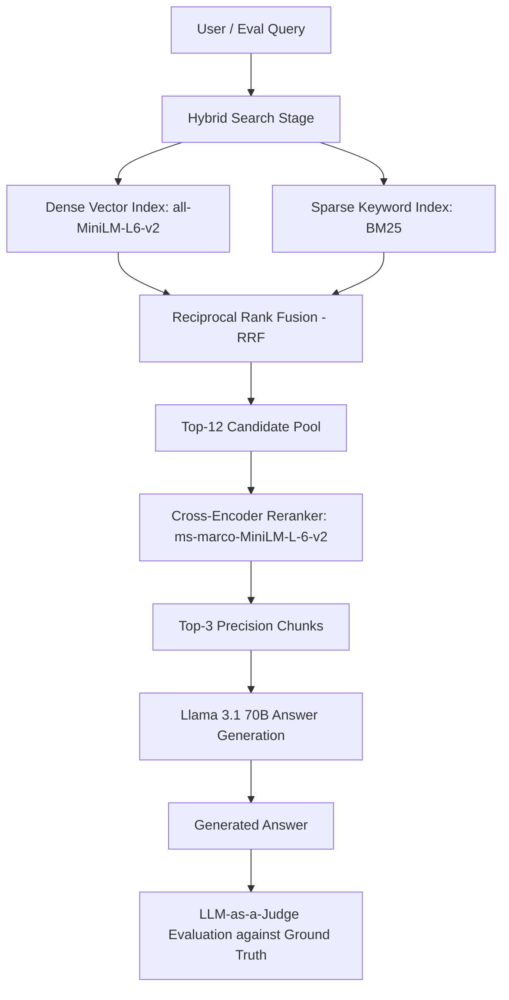

# RAG Evaluation Harness: Chunking and Hybrid Retrieval Benchmarks

[](https://www.python.org/)
[](https://www.sbert.net/)
[](https://build.nvidia.com/)
[](.github/workflows/eval.yml)

> **A systematic RAG evaluation framework measuring the impact of chunking (Simple vs. Semantic) and retrieval strategies (Dense Vector vs. Hybrid RRF + Cross-Encoder Reranking) across a labeled internal knowledge base.**

---

## Executive Summary & Benchmark Matrix

RAG pipelines frequently make unmeasured tradeoffs between chunking and retrieval strategies. This project treats chunking and retrieval as independent variables and benchmarks all four combinations across a 28-question ground-truth evaluation set.

### 2x2 Evaluation Matrix

| Chunking Strategy | Retrieval Strategy | Chunks Indexed | Retrieval@3 | Answer Accuracy (LLM-as-Judge) |
| :--- | :--- | :---: | :---: | :---: |
| **Simple (Fixed Window)** | Vector-Only (Dense) | 28 | 96.4% (27/28) | 92.9% (26/28) |
| **Simple (Fixed Window)** | **Hybrid + Rerank** | 28 | **100.0% (28/28)** | **100.0% (28/28)** |
| **Semantic (Header-Aware)** | Vector-Only (Dense) | 19 | 96.4% (27/28) | 96.4% (27/28) |
| **Semantic (Header-Aware)** | **Hybrid + Rerank** | 19 | **100.0% (28/28)** | **96.4% (27/28)** |

---

## Key Technical Findings

1. **Hybrid Retrieval (Dense + BM25) with Cross-Encoder Reranking reaches 100% Retrieval@3**:
   - Dense embeddings alone (`all-MiniLM-L6-v2`) missed on exact identifiers (e.g. `ADR-021`, specific incident dates, test suite names).
   - Reciprocal Rank Fusion (RRF) with BM25 (`rank-bm25`) and joint cross-encoder reranking (`ms-marco-MiniLM-L-6-v2`) closed all retrieval misses, achieving 100% recall ceiling across both chunking strategies.

2. **Semantic Chunking achieves equal retrieval ceiling with ~32% fewer chunks**:
   - Section-aware markdown chunking reduced index volume from **28 down to 19 chunks (32.1% reduction)**, lowering embedding storage and downstream token footprint while matching 100% hybrid retrieval accuracy.

3. **CI/CD Quality Gate**:
   - Includes automated regression checking (`eval/check_regression.py`) enforcing a $\le 5$ percentage point tolerance threshold against `eval/baseline.json`.

---

## Pipeline Architecture



---

## Project Structure

```
├── corpus/
│   ├── __init__.py
│   └── docs.py                  # 10 synthetic engineering docs with cross-doc overlap
├── app/
│   ├── __init__.py
│   ├── chunking.py              # Simple fixed-size vs. Semantic markdown-aware chunkers
│   ├── retrieval.py             # VectorIndex, BM25Index, and Reciprocal Rank Fusion (RRF)
│   ├── rerank.py                # Cross-encoder joint scoring (ms-marco-MiniLM-L-6-v2)
│   ├── llm.py                   # Rate-controlled NVIDIA LLaMA 3.1 70B Client (Answer + Judge)
│   └── pipeline.py              # Modular RAGPipeline binding any (chunk, retrieval) combo
├── eval/
│   ├── __init__.py
│   ├── qa_set.json              # 28 ground-truth labeled Q&A pairs (including cross-doc)
│   ├── results.json             # 4-config benchmark metrics
│   ├── baseline.json            # CI regression baseline
│   ├── run_eval.py              # Multi-config evaluation harness
│   └── check_regression.py      # Automated CI regression gate
├── .github/workflows/
│   └── eval.yml                 # GitHub Actions automated regression workflow
├── requirements.txt
├── WRITEUP.md                   # In-depth benchmark analysis and limitations report
└── README.md
```

---

## Quickstart & Usage

### 1. Installation

```bash
git clone https://github.com/vishalmurugan1986/rag-eval-harness.git
cd rag-eval-harness

pip install -r requirements.txt
```

### 2. Environment Configuration

```bash
export NVIDIA_API_KEY="nvapi-your-key-here"
```

### 3. Running the 2x2 Evaluation Benchmark

```bash
python -m eval.run_eval
```

Results are saved to `eval/results.json` and printed in the summary table.

### 4. Running the CI Regression Check

```bash
python -m eval.check_regression
```

Validates current evaluation numbers against `eval/baseline.json`. Fails with exit code 1 if accuracy drops by $>5\%$.

---

## Limitations & Engineering Nuances

- **Sample Size ($n=28$)**: The 3.6% delta between Simple Hybrid (28/28) and Semantic Hybrid (27/28) corresponds to exactly 1 question, which is within expected sampling noise.
- **Judge Setup**: Answer generation and LLM-as-a-judge scoring both utilize `meta/llama-3.1-70b-instruct`. Multi-model cross-evaluation is recommended for production scaling.
